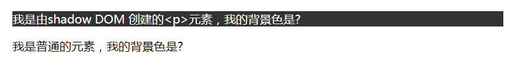

# 2019-12-28学习日志

## 选择器、选择符、伪类和伪元素

CSS选择器可以分为4类，即选择器、选择符、伪类和伪元素。

1、选择器

这里的“选择器”指的就是平常使用的CSS声明块前面的标签、类名等。例如：
```css
body {
    font: menu;
}
```
就是的body就是一种选择器，是类型选择器，也可以成为标签选择器。
```css
.container {
    background-color: olive;
}
```
这里的` .container`也是选择器，属于属性选择器的一种，我们平时称其为类选择器。
还有很多其他种类的选择器，后面讲会详细介绍。

2、选择符
目前我所知道的CSS选择器世界中的选择符有5个，即表示后代关系的空格（），表示父子关系的尖括号（>），表示相邻兄弟关系的加号（+），表示兄弟关系的弯弯（~），以及表示列关系的双管道（||）。
这5种选择符分别示意如下：

```css
/*后代关系*/
.container img {
    object-fit: cover;
}
/*父子关系*/
ol>li {
    margin: .5em 0;
}
/*相邻兄弟关系*/
button +button {
    margin-left:10px;
}
/*兄弟关系*/
button ~ button {
    margin-left: 10px;
}
/*列*/
.col || td {
    background-color: skyblue;
}
```

3、伪类
伪类的特征是其前面会有一个冒号（：），通常与浏览器行为和用户行为相关联，可以看成是CSS世界的JavaScript。伪类和选择符相互配合可以实现非常多的纯CSS交互效果。
例如：
```css
a:hover {
    color:darkblue;
}
```
4、伪元素
伪元素的特征是其前面会有两个冒号（：：），常用的有：：before，：：after，：：first-letter和：：first-line等。

## CSS选择器的作用域
以前CSS选择器只有一个全局作用域，也就是在网页任意地方的CSS都公用一个文档上下文。
如今CSS选择器是有局部作用域的概念的。伪类：scope的设计初衷就是匹配局部作用域下的元素。例如，对于下面的代码:
```html
<section>
<style scoped>
p {
    color:blue;
}
:scope {
    background-color:red;
}
</style>
<p>在作用域内，背景色应该红色。</p>
</section>
<p>在作用域外，默认背景色。</p>

```

理论上， `<section>`比爱哦前里面的`<p>`元素的背景色应该是红色，但目前没有任何浏览器表现为红色。实际上特性曾被浏览器支持过，但只是昙花一现，现在已经被舍弃。目前虽然伪类`:scope`也能解析，但只能当做全局作用域。但是，这并不表示`:scope`一无是处，它在JavaScript中还是有效的。
另外，CSS选择器的局部作用域在Shadow DOM中也是有效的。例如，有一个`<div>`元素：
```html
<div id="hostElement"></div>
```
然后使用Shadow DOM伪这个<div>元素创建一个`<p>`元素并且控制其背景色的样式，如下：
```javascript
// 创建 shadow DOM
var shadow = hostElement.attachShadow({mode: 'open'});
// 给shadow DOM 添加文字
shadow.innerHTML = '<p>我是由shadow DOM 创建的&lt;p&gt;元素，我的背景色是?</p>';
// 添加CSS，p标签背景色变成黑色
shadow.innerHTML += '<style>p{background-color:#333;color:#fff;}</style>';
```
Shadow DOM创建的<p>元素的背景色是黑色，而页面原本的<p>元素的背景色不受任何影响。

