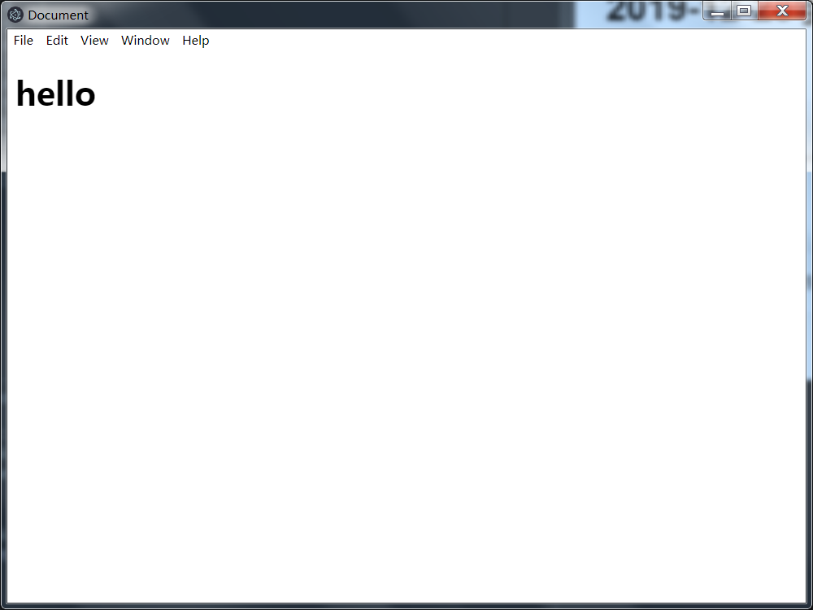

# 2019-12-28学习日志

创建目录结构
```shell
mkdir app

touch app/main.js app/renderer.js app/style.css app/index.html

npm init 

npm i electron --save
```

修改package.json里面的内容

```shell
{
  "name": "bookmarker",
  "version": "1.0.0",
  "description": "",
  "main": "./app/main.js",
  "scripts": {
    "test": "echo \"Error: no test specified\" && exit 1",
    "start":"electron ."
  },
  "author": "",
  "license": "ISC",
  "dependencies": {
    "electron": "^7.1.7"
  }
}
```
`main`入口改为`./app/main.js`
`scripts`添加`start`脚本命令`"start":"electron ."`

更新/app/main.js,主进程代码

```javascript
const { app } = require("electron");

app.on("ready", () => {
  console.log("hello from Electron!");
});

```

引入BrowserWindow模块

```javascript
const { app, BrowserWindow } = require("electron");
```

BrowserWindow可以通过new 关键字进行调用，来创建多个渲染器进程

创建一个BrowserWindow对象实例

```javascript
const { app, BrowserWindow } = require("electron");

let mainWindow = null; // 在顶层作用域中创建一个变量，引用应用的主窗口


app.on("ready", () => {
  console.log("hello from Electron!");
  mainWindow = new BrowserWindow(); // 应用准备就绪时，创建一个浏览器窗口，讲它赋值给顶层作用域中定义的变量
 
});

```
更新index.html
```html
<!DOCTYPE html>
<html lang="en">
<head>
    <meta charset="UTF-8">
    <meta name="viewport" content="width=device-width, initial-scale=1.0">
    <meta http-equiv="X-UA-Compatible" content="ie=edge">
    <title>Document</title>
</head>
<body>
    <h1>hello</h1>
</body>
</html>
```
将一个HTML文档加载到主窗口中
```javascript
const { app, BrowserWindow } = require("electron");

let mainWindow = null; 


app.on("ready", () => {
  console.log("hello from Electron!");
  mainWindow = new BrowserWindow();
  mainWindow.webContents.loadURL(`file://${__dirname}/index.html`); // 让浏览器窗口加载主进程所在目录中的一个HTML文件
});
```
运行`npm start`




更新index.html文件 引入renderer.js

```html
<!DOCTYPE html>
<html lang="en">
<head>
    <meta charset="UTF-8">
    <meta name="viewport" content="width=device-width, initial-scale=1.0">
    <meta http-equiv="X-UA-Compatible" content="ie=edge">
    <title>Document</title>
</head>
<body>
    <h1>hello</h1>
    <script>
        require('./renderer.js'); // 引入
    </script>
</body>
</html>

```

更新style.css
```css
html {
    box-sizing: border-box;
}

*, *::before, *::after {
    box-sizing: inherit;;
}

body, input {
    font: menu;
}
```
`font:menu`让我们可以在CSS中使用系统字体

更新index.html 引入样式表文件style.css

```html
<!DOCTYPE html>
<html lang="en">
<head>
    <meta charset="UTF-8">
    <meta name="viewport" content="width=device-width, initial-scale=1.0">
    <meta http-equiv="X-UA-Compatible" content="ie=edge">
    <title>Document</title>
    <link rel="stylesheet" href="style.css">
</head>
<body>
    <h1>hello</h1>
    <script>
        require('./renderer.js');
    </script>
</body>
</html>
```
