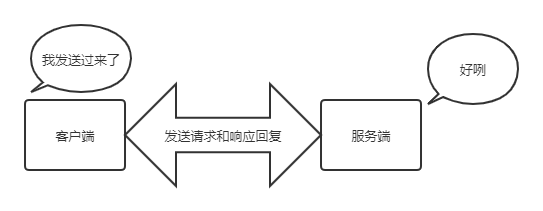
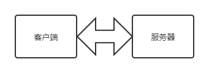
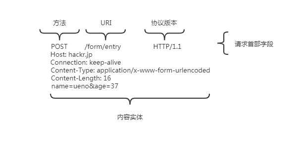
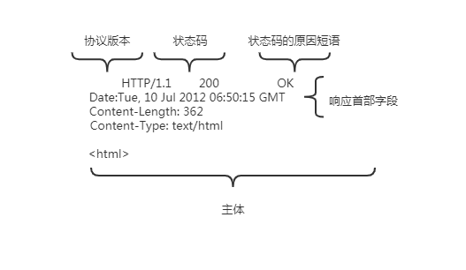

# 2019-12-27 笔记

## 通过请求和响应的交换达成通信



图：请求必定由客户端发出，而服务端响应回复

HTTP协议规定，请求从客户端发出，最后服务器端响应应该请求并返回。换句话说，肯定是先从客户端开始建立通信的，服务器端在没有接受到请求之前不会发送响应。

下面，我们来看一个具体的示例。

①发送请求

```shell
GET /HTTP/1.1 
Host: hackr.jp
```


②发送响应

```shell
HTTP/1.1 200 OK
Date: Tue, 10 Jul 2012 06:50:15 GMT
Content-Length: 362
Content-Type: text/html
<html>
...
```

下面则是从客户端发送给某个HTTP服务器端的请求报文中的内容

```shell
GET /index.htm HTTP/1.1
Host: hackr.jp
```

起始行开头的GET白哦是请求访问服务器的类型，称为方法（Method）。随后的字符串 /index.htm 指明了请求访问的资源对象，也叫做请求URI（request-URI）。最后的HTTP/1.1，即HTTP的版本号，用来提示客户端使用的HTTP协议功能。

综合来看，这段请求内容的意思是：请求访问某台HTTP服务器上的index.htm 页面资源

请求报文是由请求方法、请求URI、协议版本、可选的请求收不字段和内容实体构成的。




                       图：请求报文的构成


请求首部字段及内容实体稍后会作详细说明。接下来，我们继续讲解。接收到请求的服务器，会将请求内容的处理结果以响应的形式返回。

```shell
HTTP/1.1 200 OK
Date: Tue, 10 Jul 2012 06:50:15 GMT
Content-Length: 362
Content-Type: text/html
<html>
...
```
在起始行开头的HTTP/1.1表示服务器端对应的HTTP版本
紧挨着的200 OK 表示请求的处理结果的状态码（status code）和原因短语（reason-phrase）。下一行显示了创建响应的日期时间，是首部字段（header field）内的一个属性。

接着以一空行分隔，之后的内容称为资源实体的主体（entity body）

响应报文基本上由协议版本、状态码（表示请求成功或者失败的数字代码）、用以解释状态码的原因短语、可选的响应首部字段以及实体主题构成。稍后我们会对这些内容进行详细说明。



                            图：响应报文的构成